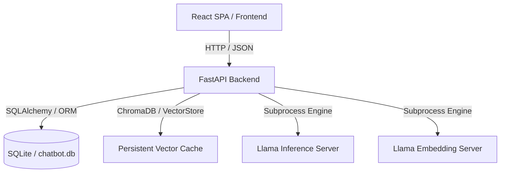

# Open-ChatBot

Plataforma stateful e modular para orquestração de agentes conversacionais locais baseados na especificação **Living Entity Framework v5**. O sistema foi concebido para suportar interações contextuais de alta fidelidade, persistência de memória episódica/semântica via RAG e modelagem comportamental dinâmica (evolução de traços e estados psicológicos).

---

## 🛠️ Arquitetura do Sistema

A solução é dividida em serviços desacoplados de alta performance:



1.  **Inference & Embedding Subsystem:** Camada de baixo nível gerenciada via binários locais do `llama-server.exe` (llama.cpp) com suporte a offloading de GPU completo (`gpu_layers: 99`), flash attention e quantizações imat GGUF. Configurado centralmente através do [models_config.json](file:///G:/Programas/Open-ChatBot/models_config.json).
2.  **FastAPI Backend:** API assíncrona responsável pela orquestração do pipeline de memória, evolução comportamental e exposição de endpoints RESTful.
3.  **React Frontend:** Interface administrativa e de conversação reativa construída com React, TypeScript, Vite e TailwindCSS, consumindo a API do backend de forma assíncrona.

---

## 🧠 Living Entity Framework v5

O motor cognitivo do chatbot baseia-se em um template dinâmico de 6 camadas (definido no componente [Brain](file:///G:/Programas/Open-ChatBot/src/backend/core/orchestration/bridge.py#L79)):

1.  **Master Prompt:** Define as regras rígidas de imersão e persona.
2.  **Identity:** Características permanentes da persona do agente.
3.  **Modifiers & Social Dynamics:** Dinâmicas sociais contextuais e regras comportamentais derivadas de interações passadas.
4.  **State & User Info:** Estados internos fisiológicos/emocionais (fome, fadiga, afeição) e metadados sobre o usuário conectado.
5.  **Context (RAG + Lorebook):** Memórias episódicas injetadas via similaridade de cossenos no Vector Store e informações de lore ativadas por palavras-chave.
6.  **History & Short-term Memory:** Janela deslizante do histórico recente da sessão atual.

---

## 🏛️ Práticas de Engenharia de Software Aplicadas

A base de código segue rigorosamente padrões industriais de engenharia de software para garantir escalabilidade horizontal, desacoplamento e testabilidade:

### 1. Clean Architecture (Separação Arquitetural)
O projeto define fronteiras claras entre suas camadas lógicas:
*   **Domain & Use Cases (Core):** Em [src/backend/core](file:///G:/Programas/Open-ChatBot/src/backend/core), isola toda a lógica do modelo comportamental, evolução psicológica e processamento RAG. Esta camada é pura e agnóstica de transporte ou persistência.
*   **Infrastructure (DB):** Em [src/backend/db](file:///G:/Programas/Open-ChatBot/src/backend/db), encapsula a persistência relacional com SQLite/SQLAlchemy.
*   **Interface Adapters (API):** Em [src/backend/api](file:///G:/Programas/Open-ChatBot/src/backend/api), gerencia as rotas FastAPI, regras de CORS, middlewares e parsing de esquemas com Pydantic.
*   **Presentation (Frontend):** Uma aplicação Web SPA contida em [src/frontend](file:///G:/Programas/Open-ChatBot/src/frontend), comunicando-se exclusivamente por JSON com o backend.

### 2. Princípios SOLID
*   **Single Responsibility (SRP):** Cada classe e módulo foca em um único domínio funcional. A classe [Brain](file:///G:/Programas/Open-ChatBot/src/backend/core/orchestration/bridge.py#L79) em [bridge.py](file:///G:/Programas/Open-ChatBot/src/backend/core/orchestration/bridge.py) encapsula exclusivamente a construção do prompt e a interação de inferência, enquanto a persistência das tags e relacionamentos é delegada ao ORM.
*   **Dependency Inversion (DIP):** Dependência de abstrações. O banco de dados (`Session`) e os clientes de LLM são injetados nas classes core via construtores, eliminando o acoplamento forte e simplificando o processo de injeção em testes unitários.

### 3. Design Patterns
*   **Facade / Orchestration:** A classe [Brain](file:///G:/Programas/Open-ChatBot/src/backend/core/orchestration/bridge.py#L79) abstrai a complexidade do pipeline de geração de respostas, ocultando acessos concorrentes ao Vector Store, banco de dados relacional e mecanismos de parser.
*   **Data Mapper / Repository:** O mapeamento declarativo do SQLAlchemy em [models.py](file:///G:/Programas/Open-ChatBot/src/backend/db/models.py) atua isolando a lógica de negócio das transações relacionais.
*   **Strategy Pattern:** A inicialização e parametrização dos runners de inferência e embedding variam com base no mapeamento do [models_config.json](file:///G:/Programas/Open-ChatBot/models_config.json), implementando diferentes parâmetros de inicialização de subprocessos sem alterar o fluxo do servidor principal.

### 4. Testes Automatizados e Ciclo de Vida Isolado
*   **Database Mocking & Isolation:** A suíte de testes unitários e de integração utiliza instâncias de bancos de dados isolados temporários para garantir que nenhum dado operacional (`chatbot.db`) seja corrompido durante a execução de testes.
*   **Coverage Rules:** Cobertura de testes mantida a $\ge 80\%$ (conforme estipulado no [GEMINI.md](file:///G:/Programas/Open-ChatBot/GEMINI.md)) tanto no backend (`pytest`) quanto no frontend.

---

## ⚡ Inicialização e Orquestração

O projeto inclui scripts de automação multi-processo que executam o build estático do frontend, orquestram os dois subprocessos de IA local e inicializam o servidor Uvicorn do backend.

### Pré-requisitos
*   **Runtime Python:** >= 3.10
*   **Node.js & Package Manager:** `pnpm` instalado globalmente.
*   **Drivers:** Suporte a aceleração de hardware (ex: Intel oneAPI ou CUDA instalados no local padrão).

### Execução Automatizada

**Windows (PowerShell ou Command Prompt):**
```cmd
run.bat
```

**Linux / macOS:**
```bash
chmod +x run.sh
./run.sh
```

*Nota: O fluxo automatizado executa `pnpm build` no diretório [src/frontend](file:///G:/Programas/Open-ChatBot/src/frontend) e expõe a build estática via FastAPI sob `/static`.*
