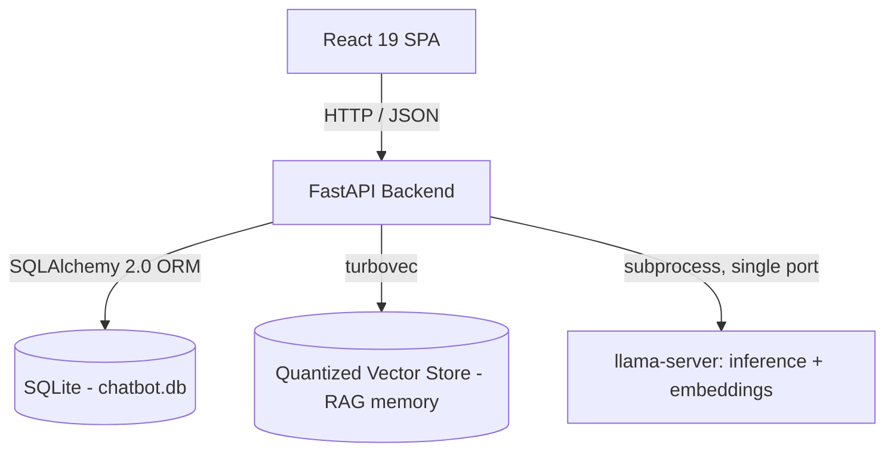

🇺🇸 English (you are here) · [🇧🇷 Leia em Português](README.pt-BR.md)

# Open-ChatBot

[](https://github.com/FellypeMelo/Open-ChatBot/actions/workflows/qa.yml)
[](https://github.com/FellypeMelo/Open-ChatBot/actions/workflows/e2e.yml)
[](LICENSE)

A local-first, single-user engine for stateful conversational characters — persistent memory, evolving relationships, and behavior grounded entirely in a self-hosted stack. No cloud LLM calls, no account, no telemetry.

### Demo — memory recall across turns


---

## What it is, and why it exists

Open-ChatBot is a FastAPI + React application that runs a character/roleplay engine entirely on your own machine, against your own local model weights. It exists to answer one question honestly: how far can a small, locally-run model get if the *engine* around it — prompt assembly, memory, and state — is taken seriously as a piece of software, instead of a pile of string concatenation?

The engine is built around the author's **Living Entity Framework v5**, a 6-layer dynamic prompt template assembled fresh on every turn:

1. **Master prompt** — fixed rules for persona consistency and output shape.
2. **Identity** — the character's permanent traits.
3. **Modifiers & social dynamics** — behavioral rules derived from relationship history.
4. **State & user info** — simulation variables (energy, mood, relationship score) and the connected user's profile.
5. **Context (RAG + lorebook)** — episodic memories retrieved by cosine similarity, plus keyword-activated lore entries.
6. **History & rolling summary** — a bounded window of recent turns, backed by a rolling summary once history is truncated.

Everything below is what actually backs that description in code — not aspirational, checked against the source in this repository.

## Architecture



* **Frontend** (`src/frontend`) — React 19 + TypeScript + Vite 8 + Tailwind CSS 4 SPA, built to static assets and served by FastAPI itself (a catch-all route mounted *after* the API routers).
* **API** (`src/backend/api`) — FastAPI routers for chat, characters, tags, users, settings, lore, and presets. Interface-adapter layer only: no business logic lives here.
* **Core** (`src/backend/core`) — transport- and persistence-agnostic domain logic: the `Brain` orchestrator (`core/orchestration/bridge.py`) that assembles the 6-layer prompt, the memory/RAG pipeline (`core/memory/vector_store.py`), context budgeting, and the lorebook scanner.
* **DB** (`src/backend/db`) — SQLAlchemy models and Alembic migrations (`src/backend/db/migrations`). `init_db()` also carries a manual-`ALTER TABLE` compatibility path for existing databases.
* **Composition root** (`core/deps.py`) — constructs the app-wide singletons (`llama_client`, `vector_store`, `brain`) exactly once; routers never build their own.
* **Inference/embedding** — a local `llama-server` (llama.cpp) binary run as a subprocess, providing both text generation and embeddings from one consolidated process. Model weights and the binary are **not bundled** — see Quickstart. An optional 2–4 bit KV-cache quantization mode (`turbo3`) is available via the author's own [llama-cpp-turboquant-SYCL](https://github.com/FellypeMelo/llama-cpp-turboquant-SYCL) fork, aimed at Intel Arc/SYCL.

Two design points worth calling out, because they are the parts most likely to bite a contributor:

* **Conversation state is split in two.** A character has exactly one persistent `AgentState` (persona, relationship, stats). Each `Chat` row owns the conversation-local pointer/summary/counters. They are explicitly synced on chat-switch — persona is shared across a character's chats, but history/memory is not.
* **History is a soft-delete-only tree.** `MessageNode.parent_id` chains form the conversation; edit/regenerate/swipe create sibling variants under the same parent. Nothing is hard-deleted, so branches can't orphan children.
* **RAG memory lives outside the relational database entirely**, in a separate quantized vector store (`turbovec`), linked to messages only by ID in metadata (no foreign key). It has its own relevance-threshold gating, cosine+recency ranking, near-duplicate dedup, and LLM-driven consolidation of aging memories.

For the deep version of all of this — turn flow, the memory/reflection cycle, the ER model — see [docs/en/architecture.md](docs/en/architecture.md) and [docs/en/data-model-er.md](docs/en/data-model-er.md).

## Quickstart

This is **not** a one-command turnkey demo: you need to supply your own GGUF model weights and a `llama-server` binary. Nothing is downloaded automatically.

### Prerequisites

* Python >= 3.10 (CI is pinned to 3.11)
* Node.js + [`pnpm`](https://pnpm.io/) installed globally — this project uses pnpm exclusively; `npm`/`yarn` are not supported workflows
* A `llama-server` binary (from [llama.cpp](https://github.com/ggml-org/llama.cpp) or the author's [turboquant-SYCL fork](https://github.com/FellypeMelo/llama-cpp-turboquant-SYCL)) and a GGUF model file of your choice
* Optional: GPU acceleration drivers for your `llama-server` build (e.g. Intel oneAPI, CUDA)

### Setup

```bash
# Backend
python -m venv venv
# Windows: venv\Scripts\activate  |  Linux/macOS: source venv/bin/activate
pip install -r requirements.txt

# Frontend
cd src/frontend && pnpm install && cd ../..

# Configure your local model
cp .env.example .env
cp models_config.example.json models_config.json
# Edit both: point MODEL_PATH / models_config.json at your own llama-server
# binary and .gguf file.
```

### Run

The bundled scripts build the frontend, boot the local `llama-server`, health-check it, then start the API:

```bash
# Windows (PowerShell or cmd)
run.bat

# Linux / macOS
chmod +x run.sh
./run.sh
```

Both scripts default to binding `0.0.0.0` (LAN-reachable, so a phone on the same Wi-Fi can connect) and print the LAN URL on startup. Pass `local` (`run.bat local` / `./run.sh local`) to bind `127.0.0.1` only. **There is no login of any kind** — anyone who can reach the bound address can use the app, so only enable LAN mode on networks you trust.

To run the backend alone, without the `llama-server` subprocess:

```bash
venv/Scripts/python.exe -m uvicorn src.backend.main:app --host 127.0.0.1 --port 8000
```

### Database migrations

`init_db()` builds/updates the schema on startup and stamps it at the current Alembic revision. Schema changes are versioned via Alembic (`src/backend/db/migrations/`); after pulling changes, run the migration yourself:

```bash
venv/Scripts/python.exe -m alembic upgrade head
```

## Testing & CI

This is enforced, not aspirational — both workflows below run on every push/PR to `main` and nightly at 02:00 UTC.

| Gate | Where | What it checks |
| :--- | :--- | :--- |
| Lint & format | `.github/workflows/qa.yml` | Ruff lint + `ruff format --check` on the backend |
| Backend tests | `.github/workflows/qa.yml` | `pytest` across 44 test files in `src/backend/__tests__`, `--cov-fail-under=80`, run on **both** `ubuntu-latest` and `windows-latest` |
| Frontend lint/build | `.github/workflows/qa.yml` | `pnpm lint`, `pnpm build` (tsc + Vite) |
| Frontend unit tests | `.github/workflows/qa.yml` | `pnpm coverage` (Vitest + React Testing Library) across 26 test files in `src/frontend/src` |
| E2E | `.github/workflows/e2e.yml` | Playwright, 9 spec files in `src/frontend/e2e`, plus a smoke test that boots `uvicorn` and curls the built static frontend for a 200 |

The Windows backend job exists because this project targets Windows/PowerShell in production and has real `win32`-only code paths (`core/engine/runner.py`) — an ubuntu-only matrix already missed a Windows-specific regression once.

Run the suites locally:

```bash
# Backend
venv/Scripts/python.exe -m pytest src/backend/__tests__ -q
venv/Scripts/python.exe -m ruff check src/backend

# Frontend (from src/frontend)
pnpm test          # vitest run
pnpm coverage      # vitest run --coverage
pnpm exec playwright test
```

There is no published coverage badge or hosted coverage report — the `--cov-fail-under=80` gate above is enforced in CI but the numbers themselves aren't exported anywhere public yet. No latency/throughput benchmarks exist in this repository either; nothing is claimed here that isn't backed by the test suite or the workflow files linked above.

## Project layout

```
src/backend/
  api/            FastAPI routers (chat, characters, tags, users, settings, lore, presets)
  core/           Domain logic: Brain orchestrator, memory/RAG, context budgeting, lorebook scanner
  db/             SQLAlchemy models + Alembic migrations
  __tests__/      44 pytest files
src/frontend/
  src/            React 19 + TypeScript + Vite + Tailwind 4 SPA
  e2e/            Playwright specs (9 files)
docs/             Architecture, data model, testing, compliance, and requirements documentation
.github/workflows/
  qa.yml          Lint, format, backend + frontend tests, coverage gate
  e2e.yml         Playwright E2E + built-frontend smoke test
```

## Documentation

Internal docs live in two mirrored trees: [docs/en/](docs/en/) (English) and [docs/pt-BR/](docs/pt-BR/) (Portuguese). Start at [docs/README.md](docs/README.md) for the language index, or jump straight in:

* [docs/en/architecture.md](docs/en/architecture.md) — turn flow, memory cycle, reflection, big-picture diagrams.
* [docs/en/data-model-er.md](docs/en/data-model-er.md) — entity-relationship model and schema decisions.
* [docs/en/testing.md](docs/en/testing.md) — running tests, isolation guarantees, adding features safely.
* [docs/en/mobile-lan-smoke-test.md](docs/en/mobile-lan-smoke-test.md) — manual mobile-device smoke-test checklist over LAN (complements Playwright's mobile emulation).
* [docs/en/card-authoring-epic.md](docs/en/card-authoring-epic.md) — how to write an E.P.I.C. character card (persona, scene, tics, examples) that makes a small model shine.
* [docs/en/setup/quickstart.md](docs/en/setup/quickstart.md) — consolidated setup/run reference (this section, plus the pieces scattered across `CLAUDE.md`/`GEMINI.md`/the run scripts).
* [docs/en/README.md](docs/en/README.md) — full documentation index (architecture, ADRs, API contract, compliance, requirements).
* [CLAUDE.md](CLAUDE.md) — command and architecture reference for contributors and coding agents.

## Roadmap

There is no fixed release plan and no version history yet (see [CHANGELOG.md](CHANGELOG.md)). Near-term direction, in the order the codebase is actually trending:

* Deepen the memory/RAG consolidation pipeline and lorebook tooling.
* Continue the mobile/PWA hardening work reflected in the recent commit history.
* Expand documented, reproducible test coverage rather than raw feature count.

A longer, more exploratory internal roadmap exists at [docs/en/planning/roadmap.md](docs/en/planning/roadmap.md); treat it as working notes on possible direction, not a committed plan — some of it (e.g. a hosted/multi-tenant deployment path) is explicitly out of scope for the local-first, single-user architecture described above.

## License

[MIT](LICENSE) © Fellype Samuel

## Author

Built and maintained by [Fellype Samuel](https://github.com/FellypeMelo).
