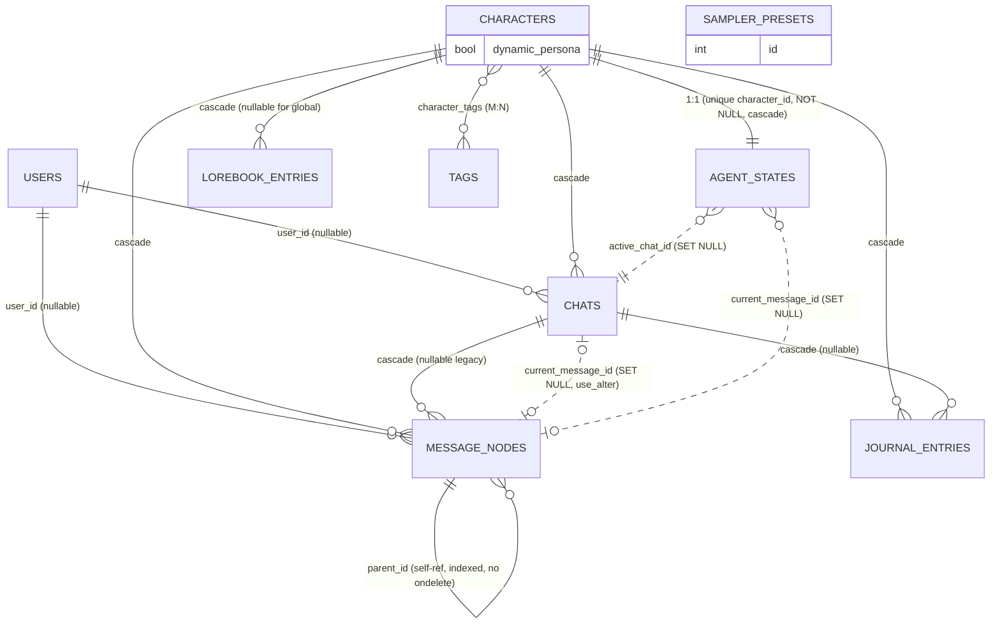

# Data Model & Entity-Relationship

The relational schema (SQLite, SQLAlchemy in `src/backend/db/models.py`) plus the
vector memory store, which lives **outside** the relational DB. This documents
the non-obvious decisions a new contributor won't get from the model file alone.

## ER diagram (relational)

## Entities

| Table | Role |
| :-- | :-- |
| **users** | The single local-user persona. A partial unique index (`uq_users_single_active`, `WHERE is_active`) makes "only one active user" a DB constraint. |
| **characters** | The AI character/card (name, persona_prompt, scenario, first_mes, alternate_greetings, mes_example…). `dynamic_persona` (Boolean, default True) toggles behavioral simulation. |
| **tags** | A personality tag + prompt instruction. M:N with characters via `character_tags`. |
| **chats** | A conversation/session with a character. Canonical store of the conversation-local fields **and** (since B8) the per-chat persona snapshot. |
| **agent_states** | The character's live state. `character_id` is `unique` + **NOT NULL** (one per character). Holds the live mirror of the active chat. |
| **message_nodes** | The message tree: self-referential `parent_id` (indexed), `is_active` soft-delete, `variant_index` for regenerate siblings. |
| **lorebook_entries** | Lore: `keys`/`secondary_keys` (JSON), `scan_depth`, `cooldown_turns`, `is_constant`, `probability`, `is_global`. |
| **journal_entries** | The character's diary (one per reflection). Scoped by `chat_id`. |
| **sampler_presets** | LLM sampler config (standalone; no FKs). |

## The non-obvious decisions (read before changing state code)

1. **The Chat ↔ AgentState "mirror".** The `Chat` row is the *canonical* store of
   the conversation-local fields — `current_message_id`, `active_summary`,
   `interaction_count`, `last_reflected_at_count` — and (since **B8**) the persona
   snapshot `location`, `mood`, `clothes`, `stats`. `AgentState` **mirrors the
   active chat's** copy live. Switching chats saves the outgoing snapshot
   (`_sync_state_to_chat`) and restores the incoming one (`_load_chat_into_state`).
   Any edit/delete of a message in a *background* chat must target the owning
   chat's row, not the live `AgentState` (`_set_branch_pointer`).

2. **Independent storylines (B8).** Persona (relationship score, mood, location,
   stats) is now **per-chat**, not global to the character. Each chat is its own
   storyline; a new chat starts from `default_stats()`; switching restores each
   chat's own persona. A background reflection that lands after a chat switch is
   applied to the *reflecting* chat's snapshot, never the now-active one
   (`evolve_character` → `_apply_reflection_to_chat`).

3. **`stats` is a JSON blob, not columns.** `agent_states.stats` / `chats.stats`
   carry energy/hunger/`relationship.score`/facts/discovered_traits/evolved_tags/
   `last_update`/`lore_cooldowns`. Deliberate: reflection can invent new keys, and
   there are no analytical queries. **Gotcha:** a plain `JSON` column snapshots at
   assignment — assign-then-mutate loses in-place edits, so always reassign
   `x.stats = ...` **last**. The one historically-queried field
   (`relationship_score`) is denormalized into `journal_entries`.

4. **RAG memory lives OUTSIDE the relational DB.** A quantized turbovec store on
   disk (`core/memory/vector_store.py`). Memories link to messages **only by a
   `message_id` value in metadata — no FK** — so they are purged *manually* on
   edit/delete/regenerate. Retrieval is filtered by exact `{character_id, chat_id}`
   and ids are never reused, so an orphaned vector (crash between the relational
   commit and the vector purge) is unreachable disk-bloat, not poison. The store
   is bounded per (character, chat) by LLM consolidation of the oldest memories
   (RQ-05). **Destructive paths commit the relational delete BEFORE purging
   vectors** — never the reverse, which would risk losing a live chat's memory.

5. **The cyclic FK** `chats.current_message_id ↔ message_nodes.chat_id` is broken
   for DDL ordering with `use_alter=True`.

6. **Pointer FKs vs ownership FKs.** Ownership edges CASCADE; pointer edges
   (`current_message_id`, `active_chat_id`) SET NULL — deleting a pointed-at
   message clears the pointer, never deletes its holder.

7. **`message_nodes.parent_id` has no `ondelete`.** The app only soft-deletes
   (`is_active=False`); hard deletes are whole-chat/whole-character bulk deletes in
   a single statement (FK-safe under `PRAGMA foreign_keys=ON`). The missing rule is
   a mild safety net (a stray single-node hard delete is *blocked*, not orphaning).

8. **Nullable `chat_id`** on message_nodes/journal_entries: legacy rows predating
   the Chat entity, adopted into a lazily-created first chat.

9. **`characters.dynamic_persona` gates the behavioral simulation (EPIC Phase 3).**
   A single Boolean (default **True**) on the character, not a per-chat field.
   *Dynamic* (default): needs decay over time and reflection evolves the persona to
   adapt to the user (relationship drift, new facts/traits, tag warmth). *Static*:
   the persona is frozen exactly as authored — no need-decay, no reflection-driven
   drift. Scene tracking (location/mood) and RAG memory recall still run in **both**
   modes; only the self-modifying simulation is switched off. Being on the character
   (not the chat), the mode is shared across all of that character's chats.

10. **Prompt-time features that deliberately add NO schema.** Three recently-shipped
    behaviors reuse existing fields/config, so a reader should *not* expect new
    tables or columns for them:
    - **Per-turn scene extractor.** A cheap LLM call each turn updates the existing
      `agent_states.location`/`mood` (and their mirrored `chats.location`/`mood`
      snapshot) — no new column; it writes the existing persona/mirror fields.
    - **Recency anchor.** The persona is re-injected at prompt-build time, derived
      from existing `characters` fields (`persona_prompt`/`short_description`). Pure
      prompt assembly — no schema, and no new `voice_style`-type column was added
      (deliberate).
    - **Token bounds.** Card size is capped by config constants (`CARD_MAX_TOKENS`,
      `RECOMMENDED_CARD_TOKENS`) and history by `HISTORY_WINDOW_TOKENS` — config,
      not schema.

## Schema management (B1)

`init_db()` builds/updates the schema on startup (`create_all` + idempotent
`ALTER` compat, zero-friction for a local app), then **stamps the DB to Alembic
head when it isn't tracked yet** — so a later `alembic upgrade head` reconciles
instead of colliding with existing tables. **Migrations are never auto-applied;
the user runs `alembic upgrade head`.** New schema changes ship as Alembic
migrations (`src/backend/db/migrations/versions/`). `PRAGMA foreign_keys=ON` is set
per connection.

Current Alembic head: **`b2f1a9c4d7e3`** (`character_dynamic_persona`, revises
`f6926d3f5da7`), which adds `characters.dynamic_persona`. The migration is guarded
(checks the column isn't already present) so it stays idempotent with the matching
`init_db` `ALTER TABLE characters ADD COLUMN dynamic_persona BOOLEAN DEFAULT 1`
compat path in `database.py`.
