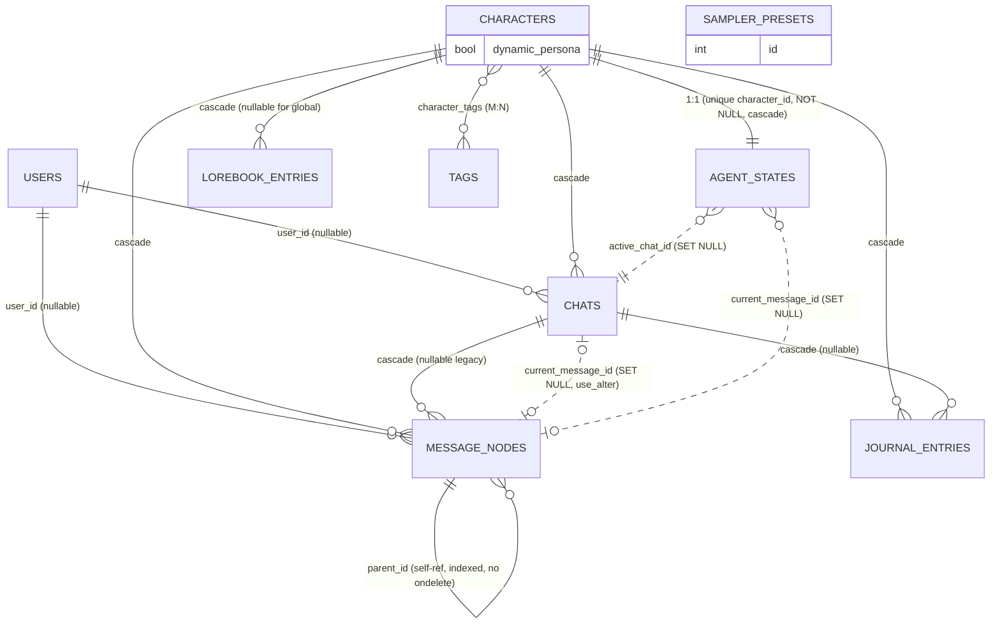

# Modelo de Dados e Entidade-Relacionamento

O schema relacional (SQLite, SQLAlchemy em `src/backend/db/models.py`) mais o
vector store de memória, que vive **fora** do banco relacional. Este documento
cobre as decisões não óbvias que um novo contribuidor não vai extrair só do
arquivo de models.

## Diagrama ER (relacional)

## Entidades

| Tabela | Papel |
| :-- | :-- |
| **users** | O único usuário local do sistema. Um índice único parcial (`uq_users_single_active`, `WHERE is_active`) torna "apenas um usuário ativo" uma constraint do banco. |
| **characters** | O personagem/card de IA (name, persona_prompt, scenario, first_mes, alternate_greetings, mes_example…). `dynamic_persona` (Boolean, padrão True) alterna a simulação comportamental. |
| **tags** | Uma tag de personalidade + instrução de prompt. M:N com characters via `character_tags`. |
| **chats** | Uma conversa/sessão com um personagem. Armazenamento canônico dos campos locais à conversa **e** (desde a B8) o snapshot de persona por chat. |
| **agent_states** | O estado ao vivo do personagem. `character_id` é `unique` + **NOT NULL** (um por personagem). Guarda o espelho ao vivo do chat ativo. |
| **message_nodes** | A árvore de mensagens: `parent_id` autorreferencial (indexado), soft-delete via `is_active`, `variant_index` para irmãos de regenerate. |
| **lorebook_entries** | Lore: `keys`/`secondary_keys` (JSON), `scan_depth`, `cooldown_turns`, `is_constant`, `probability`, `is_global`. |
| **journal_entries** | O diário do personagem (um por reflexão). Escopado por `chat_id`. |
| **sampler_presets** | Configuração de sampler do LLM (independente; sem FKs). |

## As decisões não óbvias (leia antes de mexer no código de estado)

1. **O "espelho" Chat ↔ AgentState.** A linha `Chat` é o armazenamento *canônico*
   dos campos locais à conversa — `current_message_id`, `active_summary`,
   `interaction_count`, `last_reflected_at_count` — e (desde a **B8**) o snapshot
   de persona `location`, `mood`, `clothes`, `stats`. `AgentState` **espelha a
   cópia do chat ativo** ao vivo. Trocar de chat salva o snapshot que está saindo
   (`_sync_state_to_chat`) e restaura o que está entrando (`_load_chat_into_state`).
   Qualquer edição/exclusão de uma mensagem em um chat *em segundo plano* deve
   atingir a linha do chat dono, não o `AgentState` ao vivo (`_set_branch_pointer`).

2. **Histórias independentes (B8).** A persona (score de relacionamento, humor,
   localização, stats) agora é **por chat**, não global ao personagem. Cada chat
   é sua própria história; um chat novo começa a partir de `default_stats()`;
   trocar de chat restaura a persona própria de cada chat. Uma reflexão em
   background que termina depois de uma troca de chat é aplicada ao snapshot do
   chat que *estava refletindo*, nunca ao que está ativo agora
   (`evolve_character` → `_apply_reflection_to_chat`).

3. **`stats` é um blob JSON, não colunas.** `agent_states.stats` / `chats.stats`
   carregam energy/hunger/`relationship.score`/facts/discovered_traits/
   evolved_tags/`last_update`/`lore_cooldowns`. Deliberado: a reflexão pode
   inventar chaves novas, e não há queries analíticas. **Pegadinha:** uma coluna
   `JSON` simples tira um snapshot no momento da atribuição — atribuir e depois
   mutar perde as edições in-place, então sempre reatribua `x.stats = ...` **por
   último**. O único campo historicamente consultado (`relationship_score`) é
   desnormalizado em `journal_entries`.

4. **A memória RAG vive FORA do banco relacional.** Um store turbovec quantizado
   em disco (`core/memory/vector_store.py`). As memórias se ligam às mensagens
   **apenas por um valor `message_id` no metadado — sem FK** — então são
   purgadas *manualmente* em edit/delete/regenerate. A recuperação é filtrada
   por `{character_id, chat_id}` exato, e os ids nunca são reutilizados, então um
   vetor órfão (um crash entre o commit relacional e a purga do vetor) é lixo em
   disco inalcançável, não contaminação. O store é limitado por (character, chat)
   pela consolidação via LLM das memórias mais antigas (RQ-05). **Os caminhos
   destrutivos fazem commit do delete relacional ANTES de purgar os vetores** —
   nunca o contrário, o que arriscaria perder a memória de um chat ao vivo.

5. **A FK cíclica** `chats.current_message_id ↔ message_nodes.chat_id` é quebrada
   para a ordenação de DDL com `use_alter=True`.

6. **FKs de ponteiro vs. FKs de propriedade.** As arestas de propriedade fazem
   CASCADE; as arestas de ponteiro (`current_message_id`, `active_chat_id`) fazem
   SET NULL — apagar uma mensagem apontada limpa o ponteiro, nunca apaga quem o
   possui.

7. **`message_nodes.parent_id` não tem `ondelete`.** A aplicação só faz
   soft-delete (`is_active=False`); hard deletes são exclusões em massa de chat
   inteiro/personagem inteiro em uma única instrução (seguras para FK sob
   `PRAGMA foreign_keys=ON`). A regra ausente é uma rede de segurança leve (um
   hard delete de um único nó isolado é *bloqueado*, não gera órfãos).

8. **`chat_id` anulável** em message_nodes/journal_entries: linhas legadas
   anteriores à entidade Chat, adotadas em um primeiro chat criado
   preguiçosamente.

9. **`characters.dynamic_persona` controla a simulação comportamental (EPIC Fase
   3).** Um único Boolean (padrão **True**) no personagem, não um campo por chat.
   *Dinâmico* (padrão): decay de necessidades ao longo do tempo e reflexão evolui
   a persona para se adaptar ao usuário (deriva de relacionamento, novos
   fatos/traços, calor de tag). *Estático*: a persona fica congelada exatamente
   como foi escrita — sem need-decay, sem deriva guiada por reflexão. O
   rastreamento de cena (localização/humor) e a recuperação de memória RAG ainda
   rodam em **ambos** os modos; apenas a simulação autodeterminante é desligada.
   Por estar no personagem (não no chat), o modo é compartilhado entre todos os
   chats daquele personagem.

10. **Features em tempo de prompt que deliberadamente não adicionam schema.**
    Três comportamentos lançados recentemente reaproveitam campos/config
    existentes, então quem estiver lendo *não deve* esperar novas tabelas ou
    colunas para eles:
    - **Extrator de cena por turno.** Uma chamada de LLM barata a cada turno
      atualiza os já existentes `agent_states.location`/`mood` (e o snapshot
      espelhado `chats.location`/`mood`) — sem coluna nova; ele escreve os
      campos de persona/espelho já existentes.
    - **Âncora de recência.** A persona é reinjetada no momento de montagem do
      prompt, derivada dos campos já existentes de `characters`
      (`persona_prompt`/`short_description`). Pura montagem de prompt — sem
      schema, e nenhuma coluna nova do tipo `voice_style` foi adicionada
      (deliberado).
    - **Limites de tokens.** O tamanho da card é limitado por constantes de
      config (`CARD_MAX_TOKENS`, `RECOMMENDED_CARD_TOKENS`) e o histórico por
      `HISTORY_WINDOW_TOKENS` — config, não schema.

## Gerenciamento de schema (B1)

`init_db()` constrói/atualiza o schema na inicialização (`create_all` + `ALTER`
idempotente de compatibilidade, sem atrito para uma aplicação local), e então
**marca (`stamp`) o banco no head do Alembic quando ele ainda não está rastreado**
— de modo que um `alembic upgrade head` posterior reconcilia em vez de colidir com
tabelas já existentes. **As migrações nunca são aplicadas automaticamente; o
usuário roda `alembic upgrade head`.** Mudanças de schema novas são entregues como
migrações do Alembic (`src/backend/db/migrations/versions/`). `PRAGMA
foreign_keys=ON` é definido por conexão.

Head atual do Alembic: **`b2f1a9c4d7e3`** (`character_dynamic_persona`, revisa
`f6926d3f5da7`), que adiciona `characters.dynamic_persona`. A migração é guardada
(verifica se a coluna já não está presente), então permanece idempotente com o
caminho de compatibilidade correspondente `init_db`
`ALTER TABLE characters ADD COLUMN dynamic_persona BOOLEAN DEFAULT 1` em
`database.py`.
