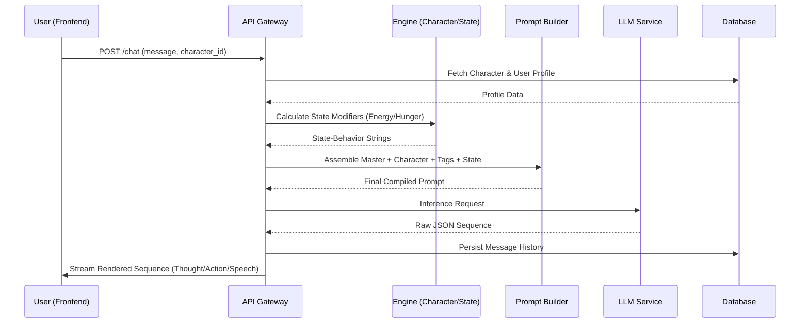
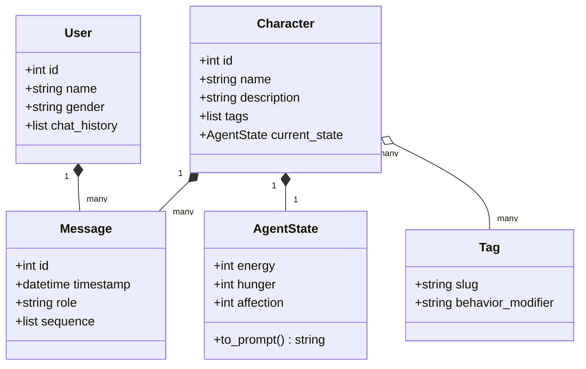
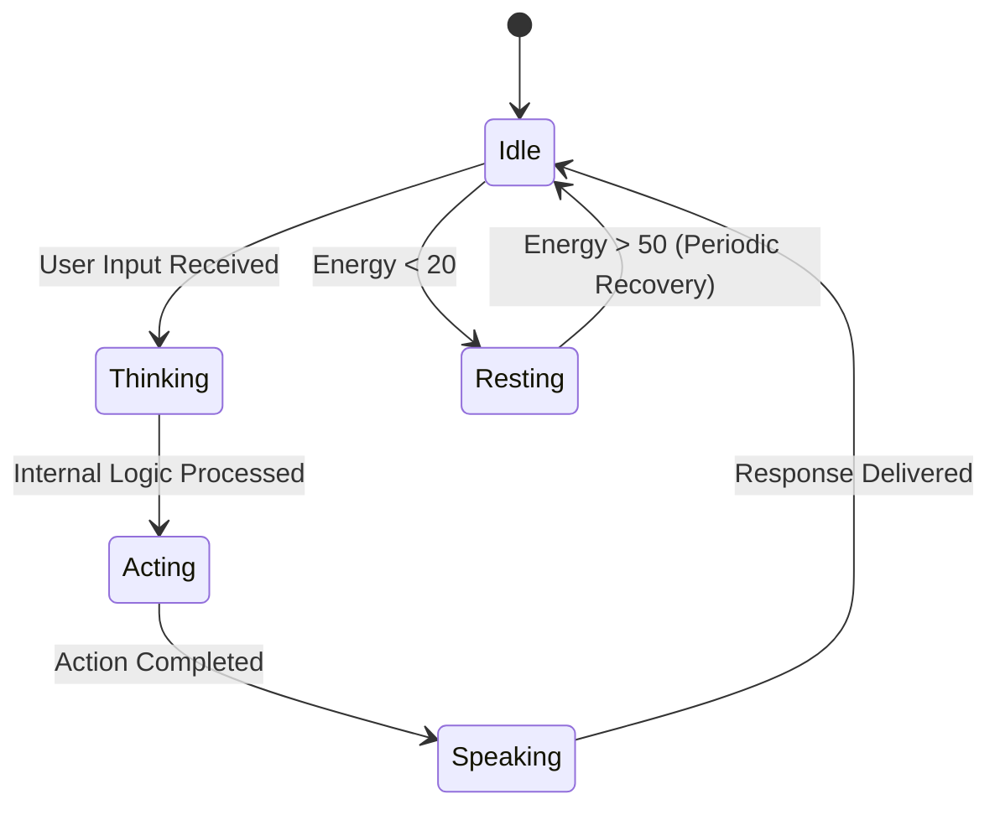

# Diagramas UML — Open-ChatBot

## 1. Diagrama de Sequência: Pipeline de Resposta da IA
Descreve o fluxo desde a entrada do usuário até a sequência narrativa renderizada.

## 2. Diagrama de Classes: Modelo de Domínio Central
Define os relacionamentos estruturais entre as entidades centrais.

## 3. Máquina de Estados: Engajamento do Personagem
Rastreia o estado emocional e físico do personagem.

